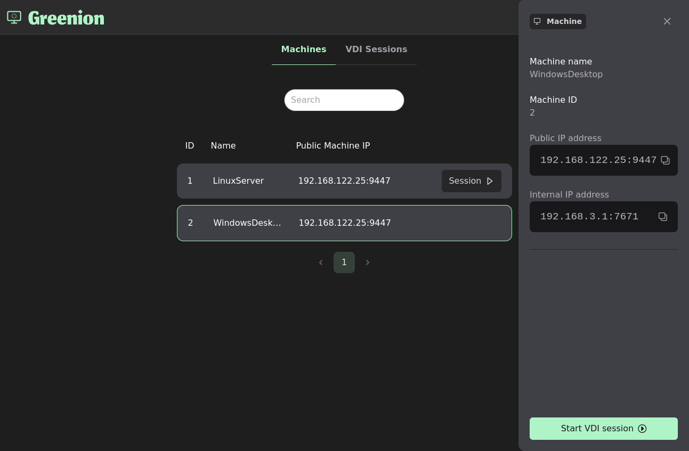

[](https://www.gnu.org/licenses/agpl-3.0)
# Greenion

Greenion is a Proof of Concept (PoC) of a VDI solution based off of the [sanzu](https://github.com/cea-sec/sanzu) remote desktop program. It consists of a web application where users can list and remote into their authorized machines, and client/server agents that carry the remote desktop part of the solution.

For greenion to work, you must deploy the web application and install two pieces of software : GreenionClient on the client computer and GreenionServer on the server. GreenionClient and GreenionServer support Windows and Linux.




# Installation

## Setup linux development environment

In this guide, we will walk through the necessary steps to have a running development environment. It will only cover **Linux**.

Configuration steps rely on `curl` and `jq`. Install them with apt:

```bash
apt install curl jq
```

First install latest LTS version of node.js (including `npm`) by following [steps from nodesource/distributions](https://github.com/nodesource/distributions).

Then install docker and docker-compose. You may use the following docs to do so:

* [install docker using the repository](https://docs.docker.com/engine/install/ubuntu/#install-using-the-repository)
* [follow post-installation steps](https://docs.docker.com/engine/install/linux-postinstall/)
* [install docker-compose](https://docs.docker.com/compose/install/#install-compose-on-linux-systems)


You then need to specify the address the users will use to access the web application.

In a local network, this may be the IP address of the server (e.g "192.168.1.43") or it's domain name if you have a DNS redirection setup. In this example, we will assume that the web server is reachable using the `server.local` domain name.

* Export the following environment variable
```bash
export DOMAIN="server.local"
```

* Replace all mentions of `greenion.local` in `docker-resources/kratos/kratos.yml` by `server.local`
* Replace all mentions of `greenion.local` in `docker-resources/env.sample.app` by `server.local`
* Replace all mentions of `greenion.local` in `docker-resources/env.sample.common` by `server.local`

From now on, you can either setup the project manually or use an automated script that sets everything up for you.

#### Automatic setup

In the root of this repo, run the following script : 
```bash
./scripts/setup-dev.sh
```

After the setup, the webapp should be available at `http://server.local:5001/`.

#### Manual setup

##### Development tools

```bash
npm ci
sudo npm i -g pino-pretty yarn
```

#### Configuration
Configuring the project will rely heavily on running npm scripts provided by the package.json file.

1. Run this script to copy and paste all environment sample files. 
```bash
npm run config:copy:all
```
You should see environmment files for hydra, kratos, web app, auth app, catalog api and monorepo being copied.

2. Now we will generate the root CA private key and the root CA certificate. Those file are necessary so rest-auth can sign certificates for machines. Run: 
```bash
npm run ca:create
```
It should output two files: `./rest-auth/certs/rootCA.key.pem` (root CA private key) and `./rest-auth/certs/rootCA.crt.pem` (root CA certificate).


3. To continue, we need to have hydra started. Run this script to only start ory hydra:
```bash
npm run debug:hydra
```

4.  To have authentification and authorization working, we need to create a oauth2 client for our web app. Let's do this by running:
```bash
npm run hydra:oauth2:create-client
```

As a result, you should see something like this:
```bash
CLIENT ID       d0e844b7-c594-458e-a40d-612aa7dad3fe
CLIENT SECRET   dM~45Upt~UDsxNL8Hv5cxlHaNP
GRANT TYPES     authorization_code, refresh_token, client_credentials
RESPONSE TYPES  code
SCOPE           openid profile email offline admin
AUDIENCE        rest-app,rest-catalog
REDIRECT URIS   http://127.0.0.1:5001/callback
```

5. Open `docker-resources/.env.app` file. Copy value of `CLIENT_ID` (of previous step) to `HYDRA_CLIENT_ID`and value `CLIENT_SECRET` (of previous step) to `HYDRA_CLIENT_SECRET`. With previous result, your env file would contain:
```bash
[...]
HYDRA_CLIENT_ID=d0e844b7-c594-458e-a40d-612aa7dad3fe
HYDRA_CLIENT_SECRET=dM~45Upt~UDsxNL8Hv5cxlHaNP
[...]
```

6. Now we will generate a new json web key set (JWKS). We do this because we want to have a key dedicated to sign jwt aim to be used as vdi session. Run:
```bash
npm run hydra:jwks:create-session-vdi
```

It should create a new file named `jwks.json` in `./rest-auth/src/config/` folder.

7. Now we need to get the key identifier of the generated jwks. We will copy this value in `.env.common` file because `rest-auth` and `rest-catalog` need to know this variable. `rest-auth` needs it to choice the correct JSON Web Key to sign jwt session vdi and `rest-catalog` needs it to allow authentification from client agent. Run:
```bash
cat ./rest-auth/src/config/jwks.json | jq -r '.keys[0].kid'
```

it should output the kid. For example:
```bash
$ cat ./rest-auth/src/config/jwks.json | jq -r '.keys[0].kid'

f7ff5ffc-ae6e-4fe2-8dc0-0df7ce65a3f7
```

8. Open `docker-resources/.env.common` and fill `HYDRA_JWKS_SESSION_VDI_KID` with the previous value. With the previous example, it would look like this:
```bash
[...]
HYDRA_JWKS_SESSION_VDI_KID=f7ff5ffc-ae6e-4fe2-8dc0-0df7ce65a3f7
[...]
```

9. Now that we have updated all the needed environment variable we can start the full docker compose. Stop hydra first with:
```bash
docker stop greenion-hydra-1
```

10. Start the docker compose with all the service using this npm script:
```bash
npm run debug
```

11. To have a working solution, we still need to create an admin user. Run the following script to create one. It will create an admin user in ory kratos (the identity provider) and in api catalog (user from kratos are synced in this api).
```bash
npm run greenion:create-user -- -u admin@example.com -p admin123 -r admin
```
A new admin user with email `admin@example.com` and password `admin123` should have been created

12. Head over [web app](http://127.0.0.1:5001) to be redirected to `auth app` to login as an admin (use the credentials previously cited)

13. If you need to perform administrative actions go to [rest-app openapi](http://127.0.0.1:5001/openapi) or [rest-catalog openapi](http://127.0.0.1:5003/openapi).


## Setup the agents

Now that the web application is up, you can add users and machines by running the commands specified in the section named "Guide" of this README document.

For remote desktop to work, you must also install the server and client agents to your server(s) and client(s). For this, please use the installers that are available in the "Releases" tab in github.

Please read [here](./greenion-agents/README.md) in order to configure the agents properly.

## Deploy to production (linux)

When deploying using the production setup, the setup differs for the most part from development by building apps before serving them.

#### Global dependencies
##### Global
Configuration steps rely on `curl` and `jq`. Install them with apt:
```bash
apt install curl jq
```

As before, export the following environment variable
```bash
export DOMAIN="server.local"
```

* Replace all mentions of `greenion.local` in `docker-resources/kratos/kratos.yml` by `server.local`
* Replace all mentions of `greenion.local` in `docker-resources/env.sample.app` by `server.local`
* Replace all mentions of `greenion.local` in `docker-resources/env.sample.common` by `server.local`


##### Node and NPM

First install the latest LTS version of node.js (including `npm`) by following [steps from nodesource/distributions](https://github.com/nodesource/distributions).
###### Docker and docker compose
Then install docker and docker-compose by following related docs:

* [install docker using the repository](https://docs.docker.com/engine/install/ubuntu/#install-using-the-repository)
* [follow post-installation steps](https://docs.docker.com/engine/install/linux-postinstall/)
* [install docker-compose](https://docs.docker.com/compose/install/#install-compose-on-linux-systems)

```bash
npm ci
```

```bash
sudo npm i -g pino-pretty yarn
```

#### Configuration
Configuring the project will rely heavily on running npm scripts provided by the package.json file.

1. Run this script to copy and paste all environment sample files. 
```bash
npm run config:copy:all
```
You should see environmment files for hydra, kratos, web app, auth app, catalog api and monorepo being copied.

2. Now we will generate the root CA private key and the root CA certificate. Those file are necessary so rest-auth can sign certificates for machines. Run: 
```bash
npm run ca:create
```
It should output two files: `./rest-auth/certs/rootCA.key.pem` (root CA private key) and `./rest-auth/certs/rootCA.crt.pem` (root CA certificate).

3. The root CA certificate needs to be referenced by the client agent. To configure it, go over [this documentation](https://git.qarnot.net/apps/greenion/-/tree/master/greenions-agents#configuring-the-client)

4. To continue, we need to have hydra started. Run this script to only start ory hydra:
```bash
npm run prod:hydra
```

5.  To have authentification and authorization working, we need to create a oauth2 client for our web app. Let's do this by running:
```bash
npm run hydra:oauth2:create-client
```

As a result, you should see something like this:
```bash
CLIENT ID       d0e844b7-c594-458e-a40d-612aa7dad3fe
CLIENT SECRET   dM~45Upt~UDsxNL8Hv5cxlHaNP
GRANT TYPES     authorization_code, refresh_token, client_credentials
RESPONSE TYPES  code
SCOPE           openid profile email offline admin
AUDIENCE        rest-app,rest-catalog
REDIRECT URIS   http://127.0.0.1:5001/callback
```

6. Open `docker-resources/.env.app` file. Copy value of `CLIENT_ID` (of previous step) to `HYDRA_CLIENT_ID`and value `CLIENT_SECRET` (of previous step) to `HYDRA_CLIENT_SECRET`. With previous result, your env file would contain:
```bash
[...]
HYDRA_CLIENT_ID=d0e844b7-c594-458e-a40d-612aa7dad3fe
HYDRA_CLIENT_SECRET=dM~45Upt~UDsxNL8Hv5cxlHaNP
[...]
```

7 Now we will generate a new json web key set (JWKS). We do this because we want to have a key dedicated to sign jwt aim to be used as vdi session. Run:
```bash
npm run hydra:jwks:create-session-vdi
```

It should create a new file named `jwks.json` in `./rest-auth/src/config/` folder.

8. Now we need to get the key identifier of the generated jwks. We will copy this value in `.env.common` file because `rest-auth` and `rest-catalog` need to know this variable. `rest-auth` needs it to choice the correct JSON Web Key to sign jwt session vdi and `rest-catalog` needs it to allow authentification from client agent. Run:
```bash
cat ./rest-auth/src/config/jwks.json | jq -r '.keys[0].kid'
```

it should output the kid. For example:
```bash
$ cat ./rest-auth/src/config/jwks.json | jq -r '.keys[0].kid'

f7ff5ffc-ae6e-4fe2-8dc0-0df7ce65a3f7
```

9. Open `docker-resources/.env.common` and fill `HYDRA_JWKS_SESSION_VDI_KID` with the previous value. With the previous example, it would look like this:
```bash
[...]
HYDRA_JWKS_SESSION_VDI_KID=f7ff5ffc-ae6e-4fe2-8dc0-0df7ce65a3f7
[...]
```

10. Now that we have updated all the needed environment variable we can start the full docker compose. Stop hydra first with:
```bash
docker stop greenion-hydra-1
```

11. Start the docker compose with all the service using this npm script:
```bash
npm run prod
```

12. To have a working solution, we still need to create an admin user. Run the following script to create one. It will create an admin user in ory kratos (the identity provider) and in api catalog (user from kratos are synced in this api).
```bash
npm run greenion:create-user -- -u admin@example.com -p admin123 -r admin
```
A new user with email `admin@example.com` and password `admin123` should have been created

13. Head over [web app](http://127.0.0.1:5001) to be redirected to `auth app` to login as an admin (use the credentials previously cited)

14. If you need to perform administrative actions go to [rest-app openapi](http://127.0.0.1:5001/openapi) or [rest-catalog openapi](http://127.0.0.5003/openapi).


## Guide
### Create an admin user

#### With the provided script

In the root of the repo :
```bash
# To see available options
npm run greenion:create-user
# Example :
npm run greenion:create-user -- -u admin@example.com -p admin123 -r admin
```

#### With the webUI

1. Log into [webapp](http://127.0.0.1:5001) with admin credential
2. Open [openapi documentation](http://127.0.0.1:5001/openapi/#/admin/post_api_v1_admin_users) to configure request to create an user
3. Click on `Try it out` button
4. Fill password, email and role (can be "user" or "admin") fields.
5. Click on `Execute` button

### Add a machine

#### With the provided script

In the root of the repo :
```bash
# To see available options
npm run greenion:create-machine
# Example :
npm run greenion:create-machine -- -n WindowsDesktop -e 192.168.3.1 -u 7671 -i 192.168.122.25 -p 9447
```

#### With the webUI

1. Log into [webapp](http://127.0.0.1:5001) with admin credential
2. Open [openapi documentation](http://127.0.0.1:5001/openapi/#/machines/post_api_v1_machines) to configure request to create a new machine
3. Click on `Try it out` button
4. Fill all the field
5. Click on `Execute` button
6. In response, you should have a signed certificate and a private key.
7. To configure the machine/server you just added, copy them to it and configure your server following [these instructions](https://git.qarnot.net/apps/greenion/-/tree/APP-11745/add-prod-docker-compose?ref_type=heads#deploy-to-production)

### Link user to machine

#### With the provided script

```bash
# To see available options
npm run greenion:link-machine
# Example :
npm run greenion:link-machine -- -u 1 -m 2
```

#### With the webUI
1. Log into [webapp](http://127.0.0.1:5001)
2. Open [openapi documentation](http://127.0.0.1:5003/openapi/#/users/post_api_v1_users__userId__machines__machineId_) to allow user to access user machine
3. Fill userId and machineId field
4. Click on `Execute` button
5. If you only have the uuid of the user (meaning its kratos id) you can use [this route](http://127.0.0.1:5003/openapi/#/users/get_api_v1_users) to get id of user (internal to api catalog) based on its uuid

## Close a session as server agent
1. Use jwt session vdi to authenticate your request
2. Request [this route](http://127.0.0.1:5003/openapi/#/sessions/put_api_v1_sessions__id_) to close a session by filling the `closedAt` field

### Env var
| Name                        | description                                                                           |
|-----------------------------|---------------------------------------------------------------------------------------|
| HYDRA_JWKS_ACCESS_TOKEN_ALG | alg used to create jwt vdi session (default is `RS256`)                               |
| HYDRA_JWKS_SESSION_VDI_KID  | Id of jwks used to create jwt vdi session                                             |
| COOKIE_NAME                 | name of cookie that act as session cookie                                             |
| COOKIE_SECRET               | secret for session cookie                                                             |
| DOMAIN                      | domain name used to access the web application (e.g "greenion.local", "192.168.1.45") |

### Endpoints
| Service name           | url in docker              | exposed url                       | Usage                                                                                                                |
|------------------------|----------------------------|-----------------------------------|----------------------------------------------------------------------------------------------------------------------|
| auth                   | 127.0.0.1:5002             | http://127.0.0.1:5002             | Web auth app will be serve on this endpoint                                                                          |
| app                    | 127.0.0.1:5001             | http://127.0.0.1:5001             | Web app will be serve on this endpoint                                                                               |
| app                    | 127.0.0.1:5001/api_catalog | http://127.0.0.1:5001/api_catalog | rest-catalog is exposed on this port so it can be use directly by frontend                                           |
| hydra (public port)    | 172.17.0.1:4444            | http://172.17.0.1:5004            | As hydra sets cookies during oauth2 flow, you may need to delete them from this address if you want to purge cookies |
| hydra (admin port)     | 172.17.0.1:4445            | http://172.17.0.1:4445            | Endpoints to create oauth2 clients                                                                                   |
| kratos (public port)   | 172.17.0.1:4433            | http://172.17.0.1:4433            | Self services flows will be created using this address                                                               |
| kratos (admin port)    | 172.17.0.1:4434            | http://172.17.0.1:4434            | You can create ressources administratively with this endpoint                                                        |
| mailslurper            | 127.0.0.1:4436             | http://127.0.0.1:4436             | Check emails emitted by ory kratos on this endpoint (not in use)                                                     |
| kratos self service ui | 127.0.0.1:4455             | http://127.0.0.1:4455             | frontend provided by ory (may be broken)                                                                             |


## How to use
### Get access token
To interact with openapi doc, you need to retrieve the access token generated thanks to the authorization code flow.

1. Go to the web app at http://127.0.0.1:5001
2. You will be redirected by the browser to http://127.0.0.1:5002 with the correct query params
3. Login with your credential (you can use the admin user defined during installation steps)
4. Then, you are redirected to the web app.
5. An access token is set in cookie
6. Tap F12 to open developer console and navigate to Storage > Cookies
7. Get value of the web_app_session cookies.
7. This access token can be use to interact with rest-app and rest-catalog as they are defined as audience of the jwt whereas rest-auth does not check audience of the token.


## Dev tools

### Scripts
#### Get hydra jwks
([more info here](https://www.ory.sh/docs/hydra/jwks)). By default, hydra generates one key for access token and another one for id token:
```bash
npm run hydra:get-well-known-jwks
```

#### Get kid value of jwks use to sign access token
```bash
npm run hydra:jwks:get-access-token-kid
```
It calls the hydra admin endpoint with the name of the json web key set (hydra.jwt.access-token).

## FAQ and troubleshoot

### I go to 127.0.0.1:5002 but nothing is happening when I enter my credential ?
The url of the login page must be populated with oauth2 params. To achieve that, you need to head over to 127.0.0.1:5001 first. You will then be redirected to the login page with the correct params and should be able to login.


### How to check my certificates ?
Here is an extract of [https://gist.github.com/Hakky54/b30418b25215ad7d18f978bc0b448d81](https://gist.github.com/Hakky54/b30418b25215ad7d18f978bc0b448d81)

```bash
# Check and read content of certificate
openssl x509 -noout -text -in rest-auth/certs/output/machine-123.crt.pem

# Check that certificate has been signed by the specified CA certificate
openssl verify -CAfile rest-auth/certs/rootCA.crt.pem rest-auth/certs/output/machine-123.crt.pem

# Check validity of private key
openssl rsa -in rest-auth/certs/output/machine-123.key -check

# Check that private key match certificate (outputs must be the same)
openssl x509 -noout -modulus -in rest-auth/certs/output/machine-123.crt.pem | openssl md5
openssl rsa -noout -modulus -in rest-auth/certs/output/machine-123.key | openssl md5
```

### Cannot find linux arm64 package on macOS ?
If your encounter this error when running project on macOS, do the following
1. delete `node_modules` and `yarn.lock` in those two folders `www-app/`, `www-auth/`

```bash
www-auth-1                    | Error: Cannot find module @rollup/rollup-linux-arm64-gnu.
```

## References
### Ory kratos
Acts as the identity provider. it is an open source and self hostable solution.

Go over the [github page](https://github.com/ory/kratos) for an in depth description.

### Ory hydra

Acts as the authorization server which allows us to perform authorization code flow for login and to issue JWT for VDI session.

Go over the [github page](https://github.com/ory/hydra) for an in depth description.


### www-app and rest-app

These subrepo (respectively the frontend and the backend) refers to the webapp where user can connect and starts sessions

### www-auth and rest-aut

These subrepo (respectively the frontend and the backend) refers to the application which only provide a login page and a backend which interfaces with ory products

### rest-catalog

This backend store the information about the machines added by an admin and the relationship between these machines and users (provided by ory kratos).


## License
This project is licensed under the terms of the AGPLv3 license, but the agents installers include [Sanzu](https://github.com/cea-sec/sanzu), which is licensed under the GPLv3 license.
